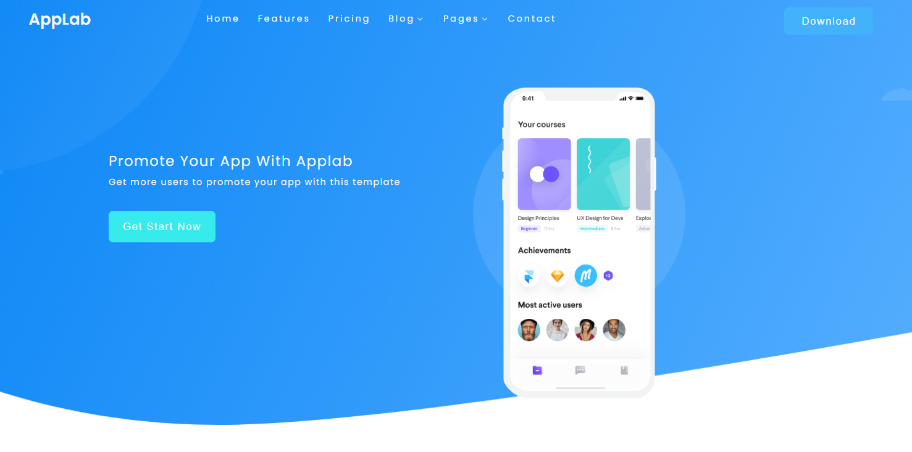
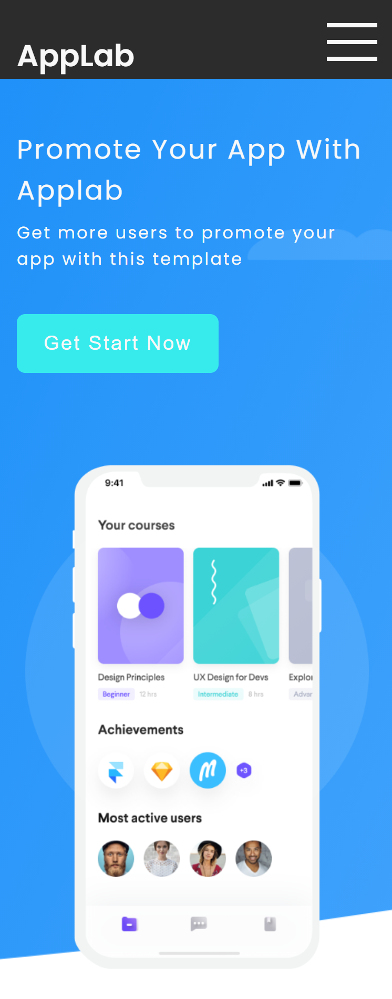

# HTML & CSS: Responsive (RWD)
## AppLab Website

Welcome to the AppLab website repository! Explore the source code for our modern and responsive template designed to showcase and promote mobile applications. The website features various sections, including a header, main features, pricing, customer reviews, and more. The primary goal of this project was to utilize only HTML and CSS to create a responsive design.

---

See the live version of [AppLab 🌐](https://maciejnecka.github.io/AppLab-RWD/)
## Desktop view

  

## Mobile view

  

## Functionalities

### Responsive Design:

- The website is responsive, adapting seamlessly to different screen sizes on desktops, tablets, and mobile devices.

### Engaging Header:

- The header section includes a visually appealing banner with a call-to-action button, inviting visitors to explore the app further.

### Highlighted Features:

- Showcase the main features of your mobile application with icons and concise descriptions, providing users with a quick overview of the app's capabilities.

### Pricing Information:

- Present different plans or subscription options for your mobile application in the pricing section.

### Customer Reviews:

- Display customer testimonials and reviews to build trust and credibility, encouraging potential users to try the app.

### Social Media Integration:

- The footer includes links to your social media profiles, making it easy for visitors to connect with your app on various platforms.

### Easy Customization:

- The project structure is organized into different sections, making it easy to customize content, images, and styles to suit your specific application and branding.

## 💡 Technologies

- 
- 

## 💿 Installation

1. First, perform a [fork](https://docs.github.com/en/pull-requests/collaborating-with-pull-requests/working-with-forks/fork-a-repo) (located at the top right corner of the page). This will create a copy of this repository on your GitHub account.

2. Clone the repository to your local machine using the [git clone](https://docs.github.com/en/repositories/creating-and-managing-repositories/cloning-a-repository) command.

Now you can work on tasks in your own repository and contribute to the project.

## 🙋‍♂️ Feel free to contact me

